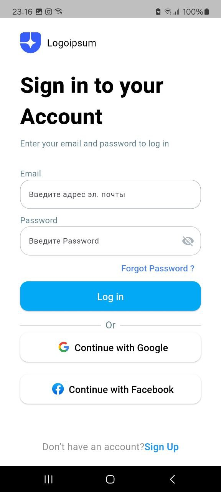
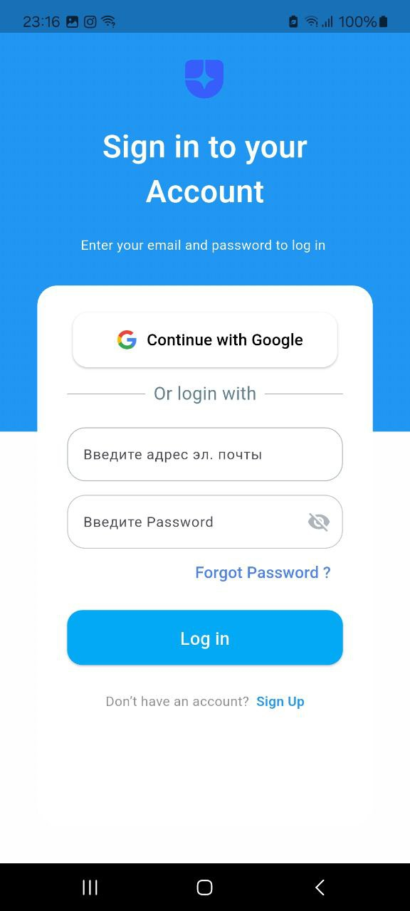
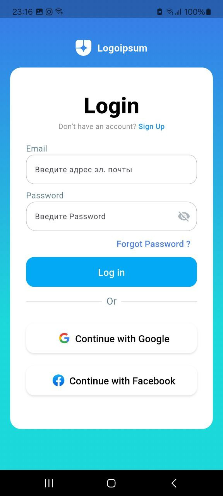

Отлично 🙌 У тебя уже есть скриншоты в `assets/screenshots/`.
Теперь нужно их подключить в `README.md`.

Обычно картинки кладут в папку `screenshots/` прямо в корне репозитория (не в `assets/`), чтобы в README их легко отображать.
👉 Но можно и так оставить — просто ссылаться на путь внутри репо.

Пример твоего простого README с добавлением скринов:

````markdown
# Sign In UI — Flutter

This project contains a ready-to-use **Sign In screen** built with Flutter.

### Features
- Gradient background (top half blue, bottom half white)  
- Google sign-in button with SVG icon  
- Email and Password input fields  
- "Forgot Password?" button  
- Navigation to another page (`TwoPage`)  
- Responsive layout using MediaQuery  

### Demo

  
  
  

### How to Run
1. Clone the repository:
```bash
git clone <repo-url>
cd <project-folder>
````

2. Install dependencies:

```bash
flutter pub get
```

3. Run the app:

```bash
flutter run
```

### Requirements

* Flutter SDK (stable channel)
* Package: `flutter_svg`
